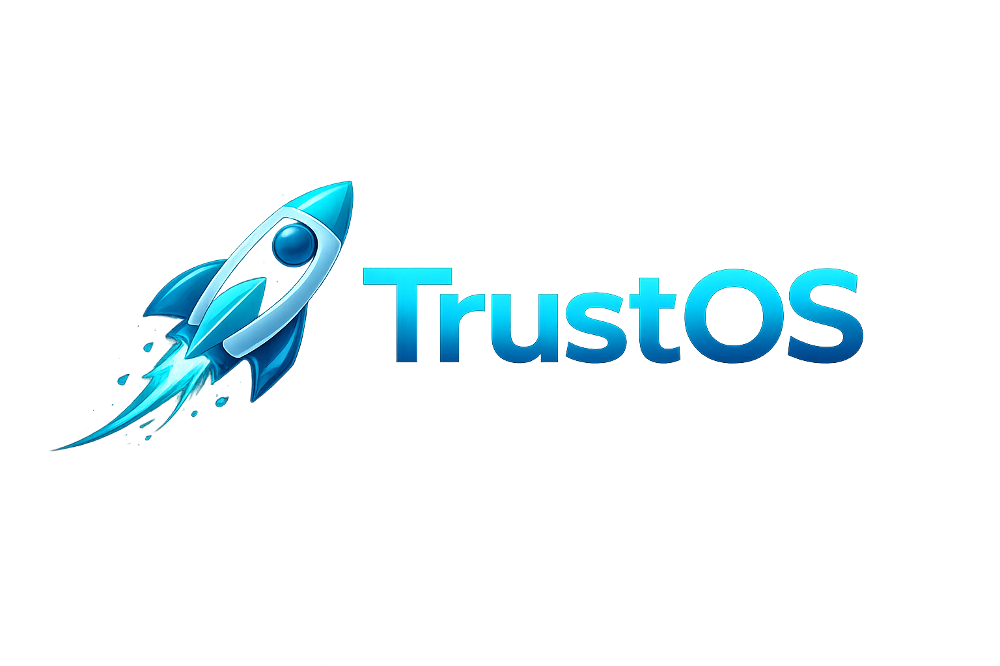

<p align="center">
  
</p>

<p align="center">
  <strong>Compliance that doesn’t kill your velocity.</strong><br />
  Open-source SOC 2 & HIPAA automation — scans, evidence, workflows, auditor handoff — without the $80k/year sticker shock.
</p>

<p align="center">
  <a href="#quickstart">Quickstart</a> ·
  <a href="#why-trustos">Why TrustOS</a> ·
  <a href="#feature-overview">Features</a> ·
  <a href="#architecture">Architecture</a> ·
  <a href="#contributing">Contributing</a>
</p>

---

## The one-liner

**Stop treating compliance like a parallel universe.** TrustOS runs your scanners, maps results to controls, stores evidence, and ships workflows your team will actually finish — then hands auditors a bundle that doesn’t require a shared drive archaeology expedition.

---

## Why TrustOS?

| The old way | The TrustOS way |
|-------------|-----------------|
| Spreadsheet cosplay | Controls + history in the product |
| “We’ll circle back post-launch” | Temporal-backed workflows that **survive restarts** |
| Another Postgres to babysit | **Zero-database app data layer** — assistants + memories on [Backboard](https://backboard.io) |
| Enterprise invoice + enterprise slog | **Self-hosted**, framework-aware, automation-first |

Most compliance platforms tax you like a luxury SUV and still leave you doing the assembly. TrustOS is built for teams that ship fast and audit honestly.

---

## Frameworks

| Framework | Status |
|-----------|--------|
| SOC 2 TSC (AICPA) | Active |
| HIPAA Security Rule | Active |
| FedRAMP Moderate | Coming soon |
| ISO 27001 | Coming soon |
| PCI-DSS | Coming soon |

---

## Feature overview

### Control library

Browse and filter by framework, track implementation status, and see cross-framework mappings with history.

### Assessment runs

Fire cloud scans (Prowler, Steampipe, Checkov, Trivy, CloudQuery). Results map to controls and refresh your posture score — no manual copy-paste pipeline.

### Evidence vault

Upload and link artifacts to controls or runs. Stored in S3 (or LocalStack in dev).

### Posture dashboard

Live pass / fail / N/A / error breakdown from your latest run, sliced by framework. Know where you stand in seconds, not slides.

### HIPAA module

A dedicated workspace for the Security Rule: PHI registry, BAAs, training, risk assessments, incidents, contingency, access reviews, policy acknowledgements, HIPAA audit log, and HIPAA-tuned exports.

### Workflows

- **People lifecycle** — onboarding / offboarding checklists on Temporal  
- **Access review campaigns** — schedule, collect attestations  
- **Policy approvals** — route and acknowledge  
- **Vendor management** — BAAs, expiry nudges  

### Remediation

Push failing findings to Slack or Jira as tickets that people can actually track.

### Auditor portal

Scoped workspace for auditors: PBC requests in-app, fulfillment without endless email threads.

### Trust center

Public security docs, NDA-gated releases, and a questionnaire library for prospects who ask the hard questions *before* the procurement call.

---

## Architecture

```
┌─────────────────────┐    ┌──────────────────────────┐
│   Next.js 15 UI     │───▶│   FastAPI (Python 3.11)  │
│  Tailwind + Radix   │    │   Pydantic v2 schemas     │
└─────────────────────┘    └────────────┬─────────────┘
                                        │
               ┌────────────────────────┼────────────────────┐
               │                        │                    │
       ┌───────▼──────┐      ┌──────────▼──────┐   ┌────────▼──────┐
       │  Backboard   │      │    Temporal      │   │   S3 / Local  │
       │  (data layer)│      │  (workflows)     │   │   Stack       │
       └──────────────┘      └─────────────────┘   └──────────────┘
```

**Backend:** FastAPI · Pydantic v2 · Backboard SDK · Temporal · boto3 · python-jose  
**Frontend:** Next.js 15 · React 19 · TypeScript · Tailwind CSS · Chart.js · Radix UI  
**Infra:** Docker Compose · LocalStack (dev S3) · Temporal

---

## Quickstart

### Prerequisites

- Docker + Docker Compose  
- Node.js 20+  
- Python 3.11+ with [`uv`](https://github.com/astral-sh/uv) (`pip install uv`)  
- A [Backboard](https://backboard.io) API key  
- Temporal (local or remote cluster)  

### 1. Clone & configure

```bash
git clone https://github.com/your-org/trustos.git
cd trustos
cp .env.example .env
# Set BACKBOARD_API_KEY, SECRET_KEY, and S3 credentials
```

### 2. Start everything

```bash
./start.sh
```

Spins up LocalStack (S3), ensures the evidence bucket exists, runs FastAPI, and starts Next.js.

| Service | URL |
|---------|-----|
| Frontend | http://localhost:3000 |
| API | http://localhost:8000 |
| API docs (Swagger) | http://localhost:8000/docs |
| LocalStack S3 | http://localhost:4566 |

### 3. First workspace

Open [http://localhost:3000](http://localhost:3000), sign up, and create a **Compliance App** for SOC 2 or HIPAA. Each workspace gets its own Backboard assistant — isolation without extra databases.

---

## Environment variables

```bash
# Backboard — primary data store
BACKBOARD_API_KEY=
BACKBOARD_ASSISTANT_ID=       # Global catalog assistant
USERS_ASSISTANT_ID=           # User record store
TRUST_ASSISTANT_ID=           # Optional: global trust center
REGISTRY_ASSISTANT_ID=        # Optional: app → assistant lookup

# Auth
SECRET_KEY=change-me-in-production
ACCESS_TOKEN_EXPIRE_MINUTES=60

# S3-compatible storage
S3_ENDPOINT_URL=http://localhost:4566
S3_REGION=us-east-1
S3_BUCKET=trustos-evidence
S3_ACCESS_KEY_ID=
S3_SECRET_ACCESS_KEY=

# Temporal
TEMPORAL_HOST=localhost
TEMPORAL_PORT=7233
TEMPORAL_NAMESPACE=default
TEMPORAL_TASK_QUEUE=proofstack

# Integrations (optional)
SLACK_WEBHOOK_URL=
JIRA_BASE_URL=
JIRA_EMAIL=
JIRA_API_TOKEN=
```

---

## RBAC

| Role | Access |
|------|--------|
| `admin` | Everything — users, all workspaces |
| `user` | Read/write within their apps |
| `viewer` | Read-only on controls, evidence, runs, posture |
| `auditor` | Scoped auditor portal + PBC uploads |

---

## Automated scanners

| Tool | What it scans |
|------|---------------|
| [Prowler](https://github.com/prowler-cloud/prowler) | AWS posture |
| [Steampipe](https://steampipe.io) | SQL over cloud inventory |
| [Checkov](https://www.checkov.io) | IaC (Terraform, CloudFormation, …) |
| [Trivy](https://aquasecurity.github.io/trivy) | Images & filesystem CVEs |
| [CloudQuery](https://www.cloudquery.io) | Asset inventory sync |

---

## Project structure

```
trustos/
├── start.sh                   # One-command dev launcher
├── docker-compose.yml         # LocalStack
├── api/
│   └── src/proofstack/
│       ├── main.py
│       ├── core/              # Config, auth, RBAC, Backboard
│       ├── api/v1/
│       ├── schemas/
│       ├── services/          # S3, Slack, Jira, exports
│       └── workers/           # Temporal workflows + activities
└── frontend/
    └── app/
        ├── components/
        ├── contexts/
        └── [feature pages]
```

---

## Contributing

PRs welcome — open an issue before large swings so we don’t collide.

1. Fork  
2. Branch (`git checkout -b feat/your-idea`)  
3. Ship changes + tests  
4. PR to `main`

---

## License

MIT © TrustOS Contributors
